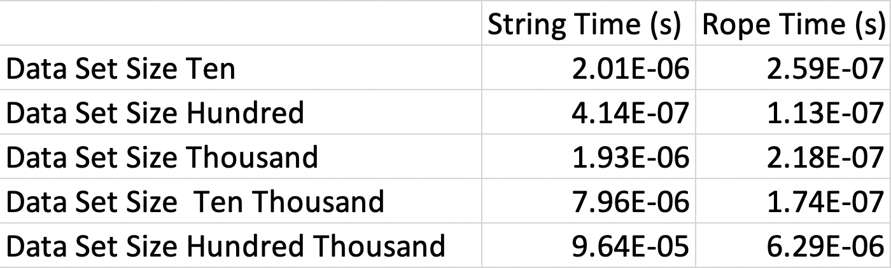
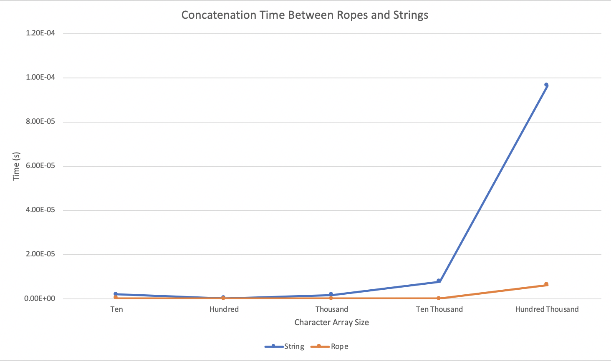

# Testing the Rope Data Structure

This program creates 5 ropes and strings of length 10, 100, 1000, 10000, and 100000 and 
concatenates them together. Then, using a high resolution clock, I time the
concatenation in order to compare the speeds of ropes and strings when 
concatenating progressively larger strings.

The findings of the testing is shown below in a graph form - with times in seconds.

Here is a line graph showing the concatenation speeds side by side.

As shown by the graph and the table, the speed of the rope's concatenation 
is vastly faster when compared to a string primitives when having to deal
with larger arrays of characters.

The full article can be found on Medium.com.